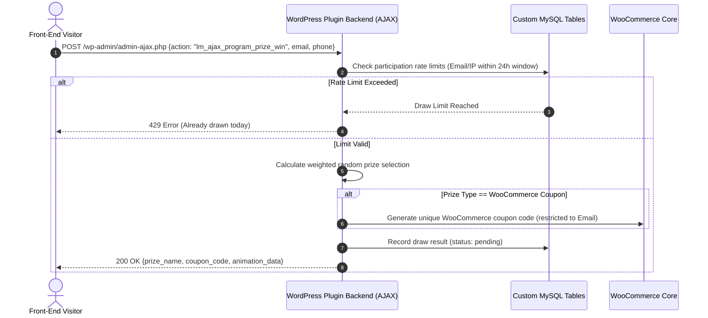

# Bốc Lì Xì (Lucky Money) — WooCommerce & WordPress Gamification Plugin

> **Custom WordPress Gamification & Dynamic Coupon Campaign Plugin**  
> *A high-converting promotional campaign plugin for WordPress & WooCommerce featuring shortcode/template rendering, AJAX prize draws, rate-limiting guards, and automated WooCommerce coupon creation.*

[](https://wordpress.org)
[](https://woocommerce.com)
[](https://php.net)
[](https://greensock.com/gsap/)

---

## 📌 Plugin Motivation & Business Use Case

In Vietnamese e-commerce and retail marketing, seasonal **Lunar New Year ("Bốc Lì Xì")** campaigns drive massive engagement. This plugin was engineered as an **independent custom WordPress plugin** to automate gamified promotion campaigns without relying on expensive monthly SaaS subscriptions.

It captures customer leads (name, email, phone number), validates drawing limits to prevent abuse, randomly selects prizes based on admin probability weights, and dynamically generates WooCommerce discount coupons.

---

## ⚙️ Core Technical Features

1. **AJAX-Powered Gamification Flow**
   - Asynchronous prize drawing via `wp_ajax_` and `wp_ajax_nopriv_` endpoints (`lm_ajax_program_prize_win`).
   - Interactive front-end animations powered by **GSAP** (GreenSock) and **ScrollTrigger**.
2. **Participation Rate Limiting & Fraud Prevention**
   - Configurable draw limits per user (`lm_option_limit_lucky_money`).
   - Multi-field verification (by Email, Phone Number, or IP Address) with sliding time windows (e.g., max 1 draw per 24 hours).
3. **WooCommerce Dynamic Coupon Integration**
   - Automatically generates single-use WooCommerce discount coupons restricted to the winner's email address upon drawing a coupon prize.
4. **Custom Database Schema & Admin Reporting**
   - Uses dedicated MySQL database tables (`wp_lm_programs`, `wp_lm_prizes`, `wp_lm_results`) to store participant records and campaign analytics.
   - Admin reporting dashboard featuring result filtering, pagination, and status tracking (`Pending → Received`).

---

## 📐 Transactional Workflow



---

## 🚀 Quick Start & Installation

### Prerequisites
* WordPress 5.8+ (PHP 7.4 or 8.x)
* WooCommerce (Optional, required if issuing coupon prizes)

### Installation Steps

1. Clone or download the repository into your WordPress plugins folder:
   ```bash
   cd wp-content/plugins/
   git clone https://github.com/huyhhuy1410/lucky-money.git lucky-money
   ```
2. Activate **Bốc Lì Xì (Lucky Money)** via **WordPress Admin $\rightarrow$ Plugins**.
3. Create a new campaign page in WordPress and select the **"Bốc Lì Xì"** page template (`boclixi.index.php`), or insert the shortcode:
   ```text
   [boclixi_page id="1"]
   ```
4. Configure campaign rules, prizes, and draw limits in **WordPress Admin $\rightarrow$ Bốc Lì Xì**.

---

## 📂 Codebase Architecture

```text
lucky-money/
├── lucky_money.php           # Plugin bootstrap, constants & hook registrations
├── admin/                    # Admin settings, prize CRUD & result reporting
├── includes/                 # Core classes (Program, Prize, Result, Email)
├── public/
│   ├── css/                  # Front-end styles & toasts
│   ├── js/                   # GSAP animation handlers & AJAX scripts
│   └── template/             # Custom WordPress page template (boclixi.index.php)
└── uninstall.php             # Database cleanup on plugin deletion
```

---

## 📄 License & Provenance Notice

This plugin is an **independent open-source project** created by Vo Quang Huy for technical demonstration and e-commerce gamification. It contains no confidential employer secrets or proprietary client data.
